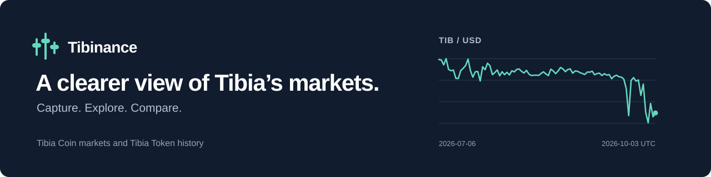

# Tibinance



**Market tools for Tibia Coin and Tibia Token.** Explore world-specific TC
prices, follow TIB’s USD history, compare trading strategies and build an
anonymous market dataset from your own screenshots.

[**Open Tibinance**](https://nesleykent.github.io/Tibinance/) |
[**Explore Markets**](https://nesleykent.github.io/Tibinance/markets.html) |
[**Read the Research**](https://nesleykent.github.io/Tibinance/reports/tc-cycle/) |
[Documentation](#documentation)

A static web app hosted on GitHub Pages. **No backend, no build step and no
API key required to use the site.**

## What you can do

| Workspace | Purpose |
| --- | --- |
| [**Capture**](https://nesleykent.github.io/Tibinance/) | Read Market Offers and 30-day Statistics screenshots, review the results and save anonymous captures locally. Import or export your dataset. |
| [**Markets**](https://nesleykent.github.io/Tibinance/markets.html) | Explore TC Sell and Buy offers by world, daily averages and transaction activity. Compare worlds in the Screener, browse events and export charts. |
| [**Tibia Token**](https://nesleykent.github.io/Tibinance/markets.html?asset=tibia-token) | Follow TIB daily USD closes and pool trading volume, with its own history, shared ranges, events and PNG export. |
| [**Trade**](https://nesleykent.github.io/Tibinance/trade.html) | Compare trading immediately with creating an offer, using the prices and quantities you enter, with the Market fee included. |
| [**Research**](https://nesleykent.github.io/Tibinance/reports/tc-cycle/) | Explore price dynamics, cycles, model validation and execution frictions in [English](https://nesleykent.github.io/Tibinance/reports/tc-cycle/) or [Brazilian Portuguese](https://nesleykent.github.io/Tibinance/reports/tc-cycle/pt-br.html). |

## Get started

**Explore the published markets:** open [Markets](https://nesleykent.github.io/Tibinance/markets.html),
choose an asset, then a world for TC. Select a range, inspect the chart or open
the Screener to compare worlds. Events and projections have their own controls;
PNG export saves the current chart view.

**Build your own capture history:**

1. Open [Capture](https://nesleykent.github.io/Tibinance/) and drop original Tibia Market screenshots.
2. Review the extracted offers or Statistics and correct flagged values.
3. Save to the local Database. Export JSON to back up complete captures and offer history.

Keep the original Hotkey filenames so the capture date and world lookup can be
resolved. [Capture format and processing details](docs/project-guide.md#filename-format)
are in the technical guide.

## Privacy by design

Captures are stored in **IndexedDB in your browser**. Screenshot images,
filenames and character names are excluded from stored records and exports.
Only anonymous market fields, capture context, offer observations and a
screenshot hash are retained.

Character names are used transiently for a **TibiaData world lookup**, then
discarded. OCR runs in the browser; the site loads its OCR libraries and public
market data over the network. The published dataset is loaded separately and
merged with local captures.

Export JSON before clearing browser data or moving to another device.
[Read the storage rules and privacy boundary](docs/project-guide.md#what-is-stored-and-what-is-not).

## Understand the data

- **TC prices are world-specific offers in gold.** Best offers, daily trade averages and transaction counters remain distinct measures. Missing days are not interpolated.
- **TIB is a separate asset.** Its chart uses completed UTC candles from a verified TIB/USDT pool, valued in USD. Pool volume is in USD; it is not TC transaction activity or global TIB volume.
- **Coverage is explicit.** Retired worlds retain their own history. TIB’s available history and provider restrictions appear in its asset panel.
- **Projections are scenarios.** TC projections reuse the Research report’s models and conditions; they are separate from observations, and their stress bands are not confidence intervals.

Official TIB contract on BNB Smart Chain:
[`0x111B95C2b65CbA53aB4E0AaDA12f55985045E446`](https://bscscan.com/token/0x111B95C2b65CbA53aB4E0AaDA12f55985045E446).

## Run locally

Clone the repository and serve it with any static web server. For example,
with Git and Python 3 installed:

```sh
git clone https://github.com/nesleykent/Tibinance.git
cd Tibinance
python3 -m http.server 8765 --bind 127.0.0.1
```

Open [localhost:8765](http://127.0.0.1:8765). The site requires no package
installation or production build. Public APIs and CDN-hosted libraries require
network access.

To host your own copy on GitHub Pages, select **Deploy from a branch**, then
**main / root** in the repository’s Pages settings.

## Development

The site uses plain HTML, CSS and JavaScript. Charts use Lightweight Charts;
screenshot OCR uses Tesseract.js. Optional Python tools support archive
processing and research reproduction.

| Location | Contents |
| --- | --- |
| [`js/`](js/) and [`css/`](css/) | Browser application, shared chart layers and styles |
| [`data/`](data/) | Anonymous captures, generated histories and frozen source inputs |
| [`reports/tc-cycle/`](reports/tc-cycle/) | Research report, analysis and reproduction materials |
| [`tools/`](tools/) | Dataset builders and optional local processing tools |
| [`tests/`](tests/) | Unit tests and browser regressions |

Run the JavaScript unit suite with a current Node.js installation:

```sh
node --test tests/*.test.mjs
```

[Verification instructions](docs/project-guide.md#verification) cover Python
checks, Playwright browser tests and optional real-image regressions.
[Dataset build and refresh instructions](docs/project-guide.md#market-history-dataset)
explain how published market history is reproduced from frozen inputs.

## Documentation

| Guide | Covers |
| --- | --- |
| [Technical guide](docs/project-guide.md) | Capture workflow, OCR, schemas, market layers, storage, dates, exports and verification |
| [Research methodology](reports/tc-cycle/README.md) | Sources, models, limitations and report reproduction |
| [Tibia Token](docs/tibia-token.md) | Contract verification, pool history, refresh workflow and future TC comparisons |
| [Market events](data/market-events/README.md) | Event sources, generation and calendar coverage |
| [CLI and archive processing](tools/README.cli.md) | Optional local batch tools and archive review |
| [Chart integration audit](docs/market-chart-integration.md) | Canonical Statistics selection and chart verification |

## Feedback

Report a reproducible problem or suggest an improvement through
[GitHub Issues](https://github.com/nesleykent/Tibinance/issues). Include the page,
browser and steps to reproduce. For data issues, include the asset or world,
market side and date. Remove character names and other personal information
from attachments.

---

Independent community project. Not affiliated with CipSoft, TibiaData or
TibiaMarket. Tibia is a trademark of CipSoft GmbH.
